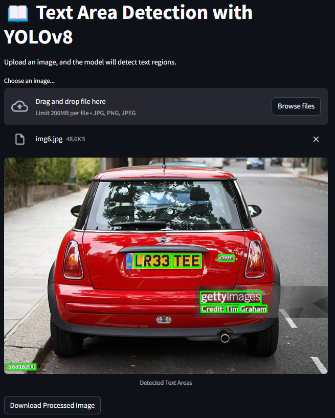

# 📜 Text Region Detection using YOLOv8

This project focuses on detecting text regions in images using YOLOv8m.

# 🚀 Features
- Text Region Detection: Trained YOLOv8m on multiple datasets to identify text regions.
- Streamlit Web App: Built an intuitive UI for users to upload images and detect text areas.

# 🖼️ Program Examples

Below are some example screenshots of the program in action:



Other images with detected text regions:


# 📂 Datasets Used

To train YOLOv8m for detecting text in images, the following datasets were utilized:

- [Icdar2013 dataset](https://www.kaggle.com/datasets/animesh2099/icdar2013-test-set/data)
- [MSRA-TD500](https://www.kaggle.com/datasets/ipythonx/msratd500)
- [COCO-Text V2.0](https://www.kaggle.com/datasets/c7934597/cocotext-v20/data?select=data)

# 📦 Installation

Download an image from [Docker Hub](https://hub.docker.com/r/davydantoniuk/yolo-text-detection):

```bash
docker pull davydantoniuk/yolo-text-detection
```

```bash
docker run -p 8501:8501 davydantoniuk/yolo-text-detection
```

Or run without Docker using the following commands:

```bash
git clone https://github.com/davydantoniuk/yolo-text-detection.git
cd yolo-text-detection/app
pip install -r requirements.txt
streamlit run app.py
```
